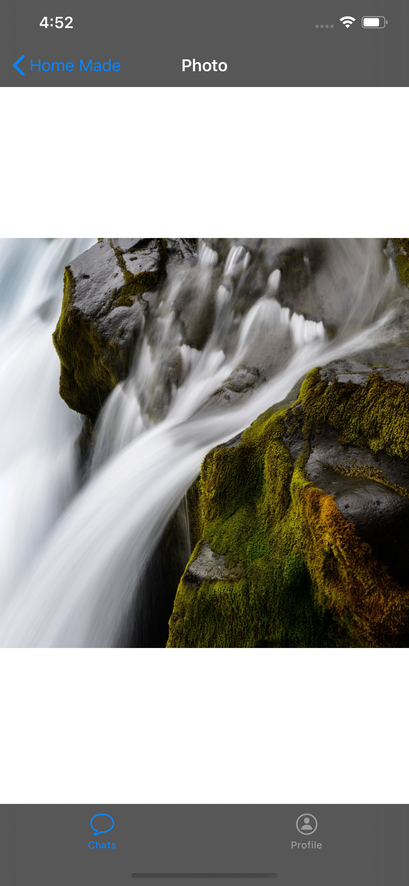

# Messanger 
Key: ChatApp, Swif 5, Firebase, iOS, Xcode

### What we will Learn
* Firebase Database, Authentication, Storage, Analytics
* Log in, Registration with Photo
* Login with Goggle, FB Singin
* Photo, Video, Message, Location Chat
* Search
* Delete Chat
* Profile View, Log Out





```swift
```
>Check out the full course and more at 
[www.joyonlineschool.com](https:www.joyonlineschool.com/)


